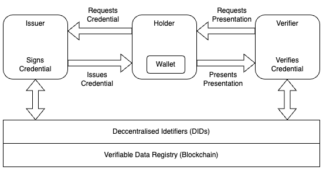

# Self Sovereign Identity

## Introduction
As per World Bank estimates, nearly 850 million people lack an official identity {cite}`world_bank_2023` and proliferation of digital devices has made it increasingly essential to possess a verifiable digital identity. This has led to a rise in the number of digital transactions and the need for a secure and reliable identity management system. Self-sovereign identity (SSI) is a decentralized identity management system that allows individuals to control their own digital identities. It is a decentralized alternative to the traditional centralised identity management system in which identities are cryptographically verifiable. This allows users to have full control over their digital identities and prevents unauthorized access to their personal information.
\
\

\
*SSI entities and their relations*

## Ongoing Research in the field of SSI

### SSI and Healthcare
Barros et. al. {cite}`de2022leveraging` explore the concepts of self-sovereign identity, blockchain technology and zero-knowledge proofs to propose a solution for presenting proof of vaccination without revealing users' identities. It allows collaboration between health organisations, governments and other stakeholders such as tourism or travel industries. Furthermore, it uses interoperable open-source tools across countries so that this system can be implemented globally at a minimal cost from each country's government.

### Land Registry using SSI
The land registry serves as a vital foundation for a country's economic development during nation-building. By documenting land-related information on a blockchain, this technology can enhance security and transparency within the land registry process.Shuaib et. al. {cite}`shuaib2022self` suggest that a blockchain-based land registry system can be combined with a self-sovereign identity (SSI) solution to provide a secure and efficient identity management system for landowners. They evaluate three existing self-sovereign identity solutions for blockchain-based land registry systems: Everest, Evernym, and uPort. These solutions are analyzed based on the self-sovereign identity principles to determine their compliance and effectiveness in addressing identity problems in land registry systems.This can help to ensure that only authorized individuals can access and modify land registry records, thereby reducing the risk of fraud and errors.

### SSI and Voting

### Conclusion

```{bibliography}
```